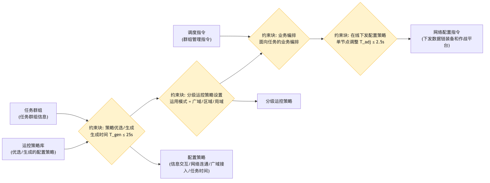

# 业务开通运行 - 参数图

## 参数图说明

参数图（Parametric Diagram）是 SysML 图，表达**参数之间的约束/计算关系**。

### 本图参数结构

| 类型     | 名称             | 说明                                |
| -------- | ---------------- | ----------------------------------- |
| 输入参数 | 任务群组         | 任务群组信息                        |
| 输入参数 | 运控策略库       | 优选/生成的配置策略                 |
| 输入参数 | 调度指令         | 群组管理指令                        |
| 约束块   | 策略优选/生成    | 生成时间 T_gen ≤ 25s                |
| 约束块   | 分级运控策略设置 | 运用模式 = 广域/区域/局域           |
| 约束块   | 业务编排         | 面向任务的业务编排                  |
| 约束块   | 在线下发配置策略 | 单节点调整 T_adj ≤ 2.5s             |
| 输出参数 | 配置策略         | 信息交互/网络连通/广域接入/任务时间 |
| 输出参数 | 分级运控策略     | 广域/区域/局域                      |
| 输出参数 | 网络配置指令     | 下发数据链装备和作战平台            |

### 约束关系

- 任务群组 + 运控策略库 → 策略优选/生成（≤25s）→ 分级运控策略设置 → 业务编排 → 在线下发（单节点 ≤2.5s）→ 网络配置指令。

## 画图素材

- 打开 draw.io 后，看左侧的「Shapes / 图形」面板
- 点击面板底部的「+ More Shapes / 更多图形」
- 在弹窗里勾选 **SysML**（或搜索 Parametric / Constraint），点确定
- 之后左侧就会出现参数图所需的素材：
  - **Constraint Block**（约束块，带等式的圆角矩形）
  - **Value Property**（参数/属性）
  - **Binding Connector**（绑定连接线）
