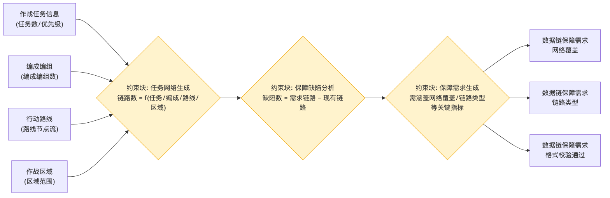

# 任务需求分解 - 参数图

## 参数图说明

参数图（Parametric Diagram）是 SysML 图，表达**参数之间的约束/计算关系**。

### 本图参数结构

| 类型     | 名称           | 说明                                  |
| -------- | -------------- | ------------------------------------- |
| 输入参数 | 作战任务信息   | 任务数、优先级                        |
| 输入参数 | 编成编组       | 编成编组数                            |
| 输入参数 | 行动路线       | 路线节点流                            |
| 输入参数 | 作战区域       | 区域范围                              |
| 约束块   | 任务网络生成   | 链路数 = f(任务 / 编成 / 路线 / 区域) |
| 约束块   | 保障缺陷分析   | 缺陷数 = 需求链路 − 现有链路          |
| 约束块   | 保障需求生成   | 需涵盖网络覆盖、链路类型等关键指标    |
| 输出参数 | 数据链保障需求 | 网络覆盖、链路类型、格式校验通过      |

### 约束关系

- 四个输入参数经「任务网络生成」约束块计算链路数；
- 链路数与现有链路经「保障缺陷分析」约束块求差得到缺陷数；
- 缺陷数经「保障需求生成」约束块转换为数据链保障需求（覆盖网络覆盖、链路类型等关键指标，并经过格式校验）。

## 画图素材

- 打开 draw.io 后，看左侧的「Shapes / 图形」面板
- 点击面板底部的「+ More Shapes / 更多图形」
- 在弹窗里勾选 **SysML**（或搜索 Parametric / Constraint），点确定
- 之后左侧就会出现参数图所需的素材：
  - **Constraint Block**（约束块，带等式的圆角矩形）
  - **Value Property**（参数/属性）
  - **Binding Connector**（绑定连接线）
