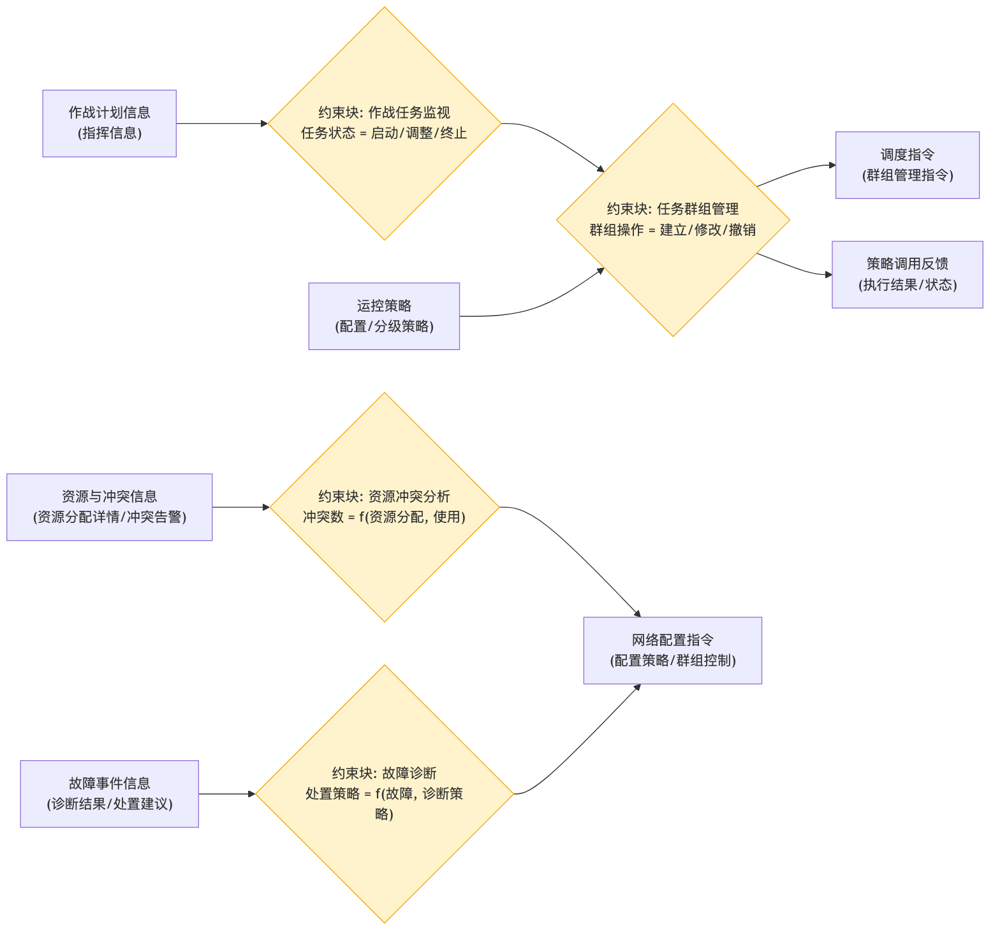

# 综合调度管理 - 参数图

## 参数图说明

参数图（Parametric Diagram）是 SysML 图，表达**参数之间的约束/计算关系**。

### 本图参数结构

| 类型     | 名称           | 说明                         |
| -------- | -------------- | ---------------------------- |
| 输入参数 | 作战计划信息   | 指挥信息                     |
| 输入参数 | 运控策略       | 配置/分级策略                |
| 输入参数 | 资源与冲突信息 | 资源分配详情、冲突告警       |
| 输入参数 | 故障事件信息   | 诊断结果、处置建议           |
| 约束块   | 作战任务监视   | 任务状态 = 启动/调整/终止    |
| 约束块   | 任务群组管理   | 群组操作 = 建立/修改/撤销    |
| 约束块   | 资源冲突分析   | 冲突数 = f(资源分配, 使用)   |
| 约束块   | 故障诊断       | 处置策略 = f(故障, 诊断策略) |
| 输出参数 | 调度指令       | 群组管理指令                 |
| 输出参数 | 网络配置指令   | 配置策略、群组控制           |
| 输出参数 | 策略调用反馈   | 执行结果、状态               |

### 约束关系

- 作战计划信息 → 任务监视 → 任务群组管理（建立/修改/撤销）；
- 资源与冲突信息 → 资源冲突分析 → 网络配置指令（支持资源冲突消解）；
- 故障事件信息 → 故障诊断 → 网络配置指令（支持故障处理）。

## 画图素材

- 打开 draw.io 后，看左侧的「Shapes / 图形」面板
- 点击面板底部的「+ More Shapes / 更多图形」
- 在弹窗里勾选 **SysML**（或搜索 Parametric / Constraint），点确定
- 之后左侧就会出现参数图所需的素材：
  - **Constraint Block**（约束块，带等式的圆角矩形）
  - **Value Property**（参数/属性）
  - **Binding Connector**（绑定连接线）
