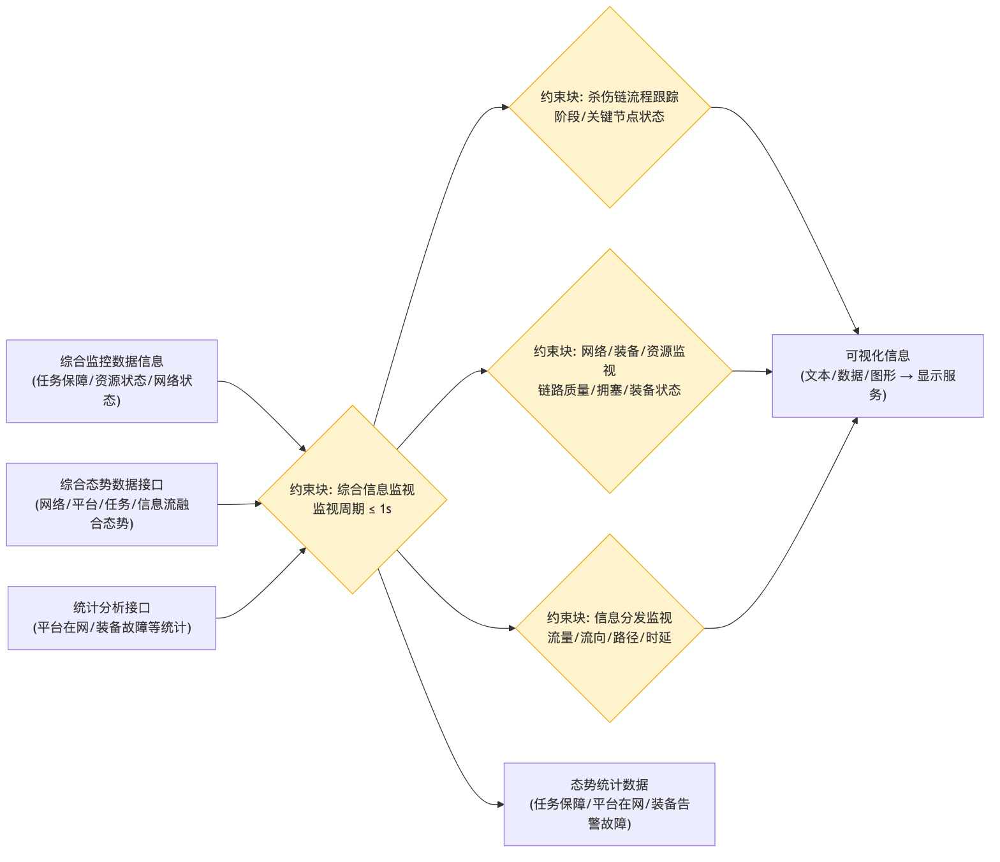

# 运控态势监控 - 参数图

## 参数图说明

参数图（Parametric Diagram）是 SysML 图，表达**参数之间的约束/计算关系**。

### 本图参数结构

| 类型     | 名称               | 说明                             |
| -------- | ------------------ | -------------------------------- |
| 输入参数 | 综合监控数据信息   | 任务保障、资源状态、网络状态     |
| 输入参数 | 综合态势数据接口   | 网络/平台/任务/信息流融合态势    |
| 输入参数 | 统计分析接口       | 平台在网、装备故障等统计         |
| 约束块   | 综合信息监视       | 监视周期 ≤ 1s                    |
| 约束块   | 杀伤链流程跟踪     | 阶段、关键节点状态               |
| 约束块   | 网络/装备/资源监视 | 链路质量、拥塞、装备状态         |
| 约束块   | 信息分发监视       | 流量、流向、路径、时延           |
| 输出参数 | 可视化信息         | 文本/数据/图形 → 显示服务        |
| 输出参数 | 态势统计数据       | 任务保障、平台在网、装备告警故障 |

### 约束关系

- 三类输入 → 综合信息监视（更新周期 ≤1s）→ 杀伤链流程跟踪 / 网络装备资源监视 / 信息分发监视 → 可视化信息输出给显示服务。

## 画图素材

- 打开 draw.io 后，看左侧的「Shapes / 图形」面板
- 点击面板底部的「+ More Shapes / 更多图形」
- 在弹窗里勾选 **SysML**（或搜索 Parametric / Constraint），点确定
- 之后左侧就会出现参数图所需的素材：
  - **Constraint Block**（约束块，带等式的圆角矩形）
  - **Value Property**（参数/属性）
  - **Binding Connector**（绑定连接线）
