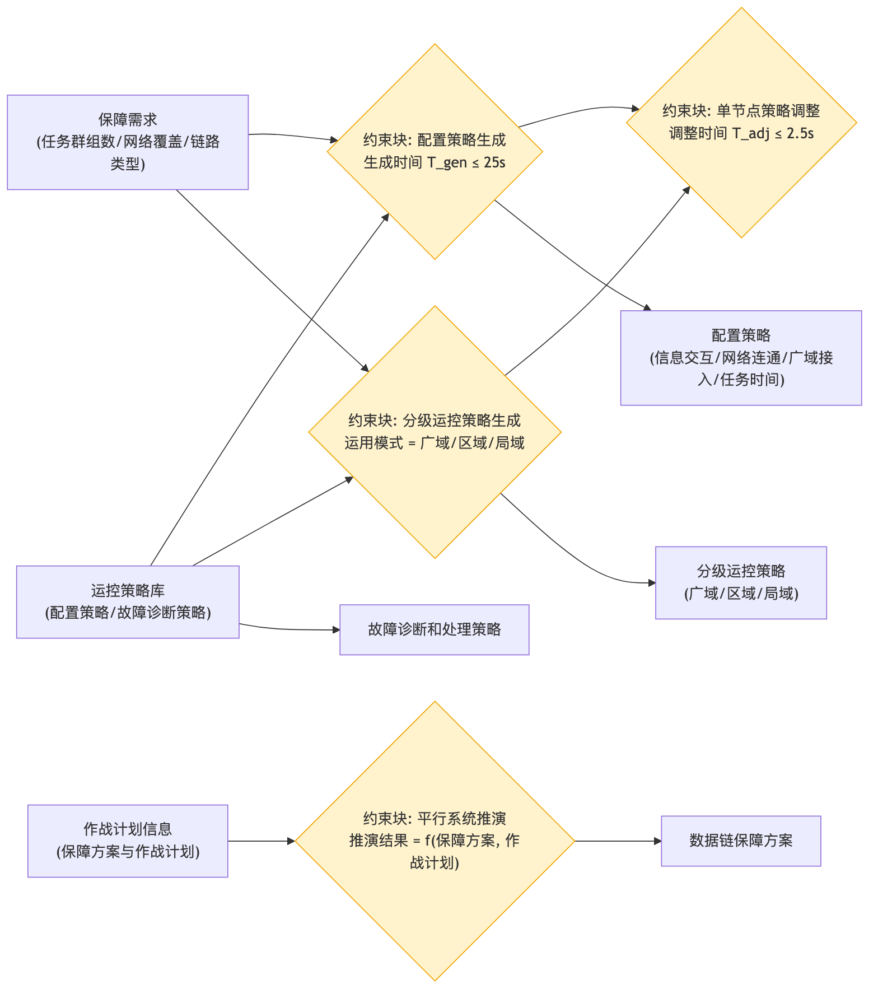

# 运控策略制定 - 参数图

## 参数图说明

参数图（Parametric Diagram）是 SysML 图，表达**参数之间的约束/计算关系**。

### 本图参数结构

| 类型     | 名称               | 说明                                |
| -------- | ------------------ | ----------------------------------- |
| 输入参数 | 保障需求           | 任务群组数、网络覆盖、链路类型      |
| 输入参数 | 运控策略库         | 配置策略、故障诊断策略              |
| 输入参数 | 作战计划信息       | 保障方案与作战计划                  |
| 约束块   | 配置策略生成       | 生成时间 T_gen ≤ 25s                |
| 约束块   | 分级运控策略生成   | 运用模式 = 广域/区域/局域           |
| 约束块   | 单节点策略调整     | 调整时间 T_adj ≤ 2.5s               |
| 约束块   | 平行系统推演       | 推演结果 = f(保障方案, 作战计划)    |
| 输出参数 | 配置策略           | 信息交互/网络连通/广域接入/任务时间 |
| 输出参数 | 分级运控策略       | 广域/区域/局域                      |
| 输出参数 | 数据链保障方案     | 发送平行系统推演                    |
| 输出参数 | 故障诊断和处理策略 | 存入策略库                          |

### 约束关系

- 保障需求 + 运控策略库 → 配置策略生成（≤25s）→ 单节点调整（≤2.5s）；
- 保障需求 + 策略库 → 分级运控策略（广域/区域/局域）；
- 作战计划信息 → 平行系统推演 → 数据链保障方案。

## 画图素材

- 打开 draw.io 后，看左侧的「Shapes / 图形」面板
- 点击面板底部的「+ More Shapes / 更多图形」
- 在弹窗里勾选 **SysML**（或搜索 Parametric / Constraint），点确定
- 之后左侧就会出现参数图所需的素材：
  - **Constraint Block**（约束块，带等式的圆角矩形）
  - **Value Property**（参数/属性）
  - **Binding Connector**（绑定连接线）
