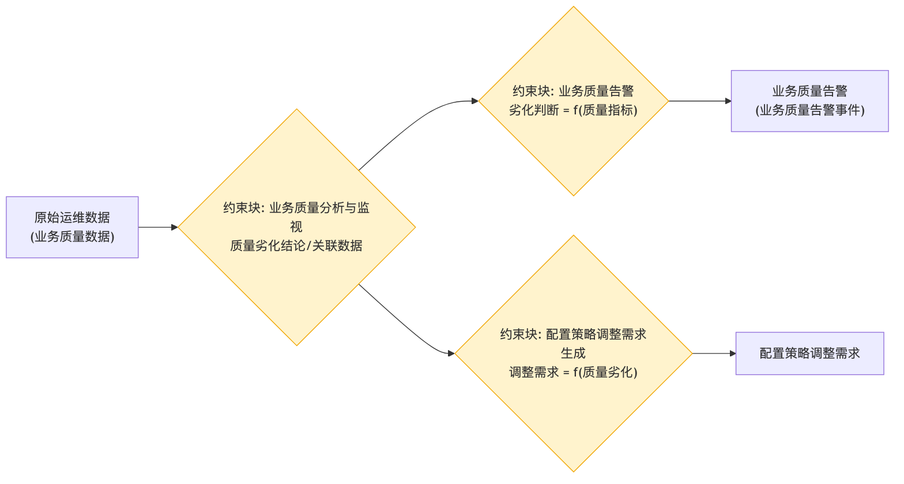

# 业务质量监控处理 - 参数图

## 参数图说明

参数图（Parametric Diagram）是 SysML 图，表达**参数之间的约束/计算关系**。

### 本图参数结构

| 类型     | 名称                 | 说明                   |
| -------- | -------------------- | ---------------------- |
| 输入参数 | 原始运维数据         | 业务质量数据           |
| 约束块   | 业务质量分析与监视   | 质量劣化结论、关联数据 |
| 约束块   | 业务质量告警         | 劣化判断 = f(质量指标) |
| 约束块   | 配置策略调整需求生成 | 调整需求 = f(质量劣化) |
| 输出参数 | 业务质量告警         | 业务质量告警事件       |
| 输出参数 | 配置策略调整需求     | 通知体系运营管理子系统 |

### 约束关系

- 业务质量数据 → 业务质量分析与监视 → 业务质量告警 / 配置策略调整需求生成。

## 画图素材

- 打开 draw.io 后，看左侧的「Shapes / 图形」面板
- 点击面板底部的「+ More Shapes / 更多图形」
- 在弹窗里勾选 **SysML**（或搜索 Parametric / Constraint），点确定
- 之后左侧就会出现参数图所需的素材：
  - **Constraint Block**（约束块，带等式的圆角矩形）
  - **Value Property**（参数/属性）
  - **Binding Connector**（绑定连接线）
