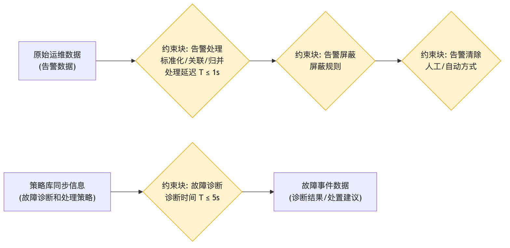

# 告警监视处理 - 参数图

## 参数图说明

参数图（Parametric Diagram）是 SysML 图，表达**参数之间的约束/计算关系**。

### 本图参数结构

| 类型     | 名称           | 说明                              |
| -------- | -------------- | --------------------------------- |
| 输入参数 | 原始运维数据   | 告警数据                          |
| 输入参数 | 策略库同步信息 | 故障诊断和处理策略                |
| 约束块   | 告警处理       | 标准化/关联/归并，处理延迟 T ≤ 1s |
| 约束块   | 告警屏蔽       | 屏蔽规则                          |
| 约束块   | 告警清除       | 人工/自动方式                     |
| 约束块   | 故障诊断       | 诊断时间 T ≤ 5s                   |
| 输出参数 | 故障事件数据   | 诊断结果、处置建议                |

### 约束关系

- 告警数据 → 告警处理（延迟 ≤1s）→ 告警屏蔽 → 告警清除；
- 策略库同步信息 → 故障诊断（诊断时间 ≤5s）→ 故障事件数据。

## 画图素材

- 打开 draw.io 后，看左侧的「Shapes / 图形」面板
- 点击面板底部的「+ More Shapes / 更多图形」
- 在弹窗里勾选 **SysML**（或搜索 Parametric / Constraint），点确定
- 之后左侧就会出现参数图所需的素材：
  - **Constraint Block**（约束块，带等式的圆角矩形）
  - **Value Property**（参数/属性）
  - **Binding Connector**（绑定连接线）
