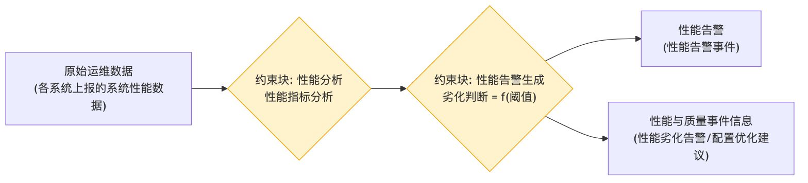

# 性能监视处理 - 参数图

## 参数图说明

参数图（Parametric Diagram）是 SysML 图，表达**参数之间的约束/计算关系**。

### 本图参数结构

| 类型     | 名称               | 说明                       |
| -------- | ------------------ | -------------------------- |
| 输入参数 | 原始运维数据       | 各系统上报的系统性能数据   |
| 约束块   | 性能分析           | 性能指标分析               |
| 约束块   | 性能告警生成       | 劣化判断 = f(阈值)         |
| 输出参数 | 性能告警           | 性能告警事件               |
| 输出参数 | 性能与质量事件信息 | 性能劣化告警、配置优化建议 |

### 约束关系

- 系统性能数据 → 性能分析 → 性能告警生成（阈值判断）→ 性能告警 / 性能与质量事件信息。

## 画图素材

- 打开 draw.io 后，看左侧的「Shapes / 图形」面板
- 点击面板底部的「+ More Shapes / 更多图形」
- 在弹窗里勾选 **SysML**（或搜索 Parametric / Constraint），点确定
- 之后左侧就会出现参数图所需的素材：
  - **Constraint Block**（约束块，带等式的圆角矩形）
  - **Value Property**（参数/属性）
  - **Binding Connector**（绑定连接线）
