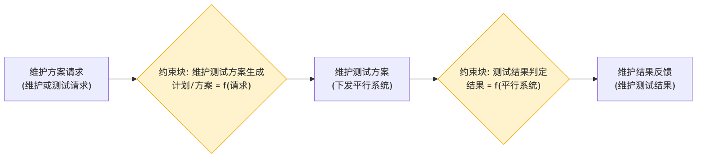

# 装备维护测试 - 参数图

## 参数图说明

参数图（Parametric Diagram）是 SysML 图，表达**参数之间的约束/计算关系**。

### 本图参数结构

| 类型     | 名称             | 说明                |
| -------- | ---------------- | ------------------- |
| 输入参数 | 维护方案请求     | 维护或测试请求      |
| 约束块   | 维护测试方案生成 | 计划/方案 = f(请求) |
| 约束块   | 测试结果判定     | 结果 = f(平行系统)  |
| 输出参数 | 维护测试方案     | 下发平行系统        |
| 输出参数 | 维护结果反馈     | 维护测试结果        |

### 约束关系

- 维护方案请求 → 维护测试方案生成 → 下发平行系统 → 测试结果判定 → 维护结果反馈。

## 画图素材

- 打开 draw.io 后，看左侧的「Shapes / 图形」面板
- 点击面板底部的「+ More Shapes / 更多图形」
- 在弹窗里勾选 **SysML**（或搜索 Parametric / Constraint），点确定
- 之后左侧就会出现参数图所需的素材：
  - **Constraint Block**（约束块，带等式的圆角矩形）
  - **Value Property**（参数/属性）
  - **Binding Connector**（绑定连接线）
