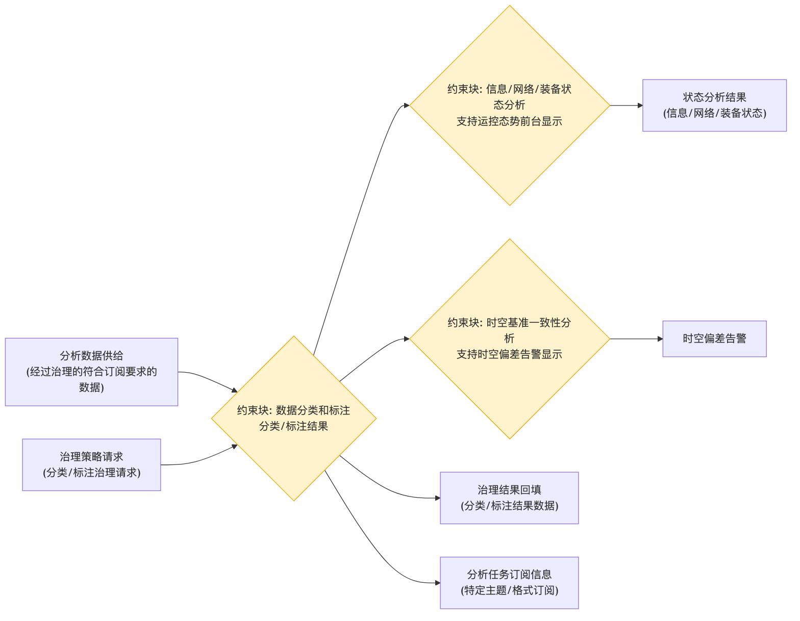

# 数据分析 - 参数图

## 参数图说明

参数图（Parametric Diagram）是 SysML 图，表达**参数之间的约束/计算关系**。

### 本图参数结构

| 类型     | 名称                   | 说明                         |
| -------- | ---------------------- | ---------------------------- |
| 输入参数 | 分析数据供给           | 经过治理的符合订阅要求的数据 |
| 输入参数 | 治理策略请求           | 分类、标注治理请求           |
| 约束块   | 数据分类和标注         | 分类、标注结果               |
| 约束块   | 信息/网络/装备状态分析 | 支持运控态势前台显示         |
| 约束块   | 时空基准一致性分析     | 支持时空偏差告警显示         |
| 输出参数 | 治理结果回填           | 分类、标注结果数据           |
| 输出参数 | 状态分析结果           | 信息/网络/装备状态           |
| 输出参数 | 时空偏差告警           | 时空偏差告警显示             |
| 输出参数 | 分析任务订阅信息       | 特定主题、格式订阅           |

### 约束关系

- 分析数据供给 → 数据分类和标注 → 状态分析 / 时空基准一致性分析 / 治理结果回填 / 分析任务订阅信息。

## 画图素材

- 打开 draw.io 后，看左侧的「Shapes / 图形」面板
- 点击面板底部的「+ More Shapes / 更多图形」
- 在弹窗里勾选 **SysML**（或搜索 Parametric / Constraint），点确定
- 之后左侧就会出现参数图所需的素材：
  - **Constraint Block**（约束块，带等式的圆角矩形）
  - **Value Property**（参数/属性）
  - **Binding Connector**（绑定连接线）
