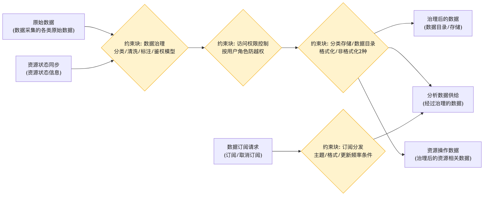

# 数据管理 - 参数图

## 参数图说明

参数图（Parametric Diagram）是 SysML 图，表达**参数之间的约束/计算关系**。

### 本图参数结构

| 类型     | 名称              | 说明                    |
| -------- | ----------------- | ----------------------- |
| 输入参数 | 原始数据          | 数据采集的各类原始数据  |
| 输入参数 | 资源状态同步      | 资源状态信息            |
| 输入参数 | 数据订阅请求      | 订阅/取消订阅           |
| 约束块   | 数据治理          | 分类/清洗/标注/鉴权模型 |
| 约束块   | 访问权限控制      | 按用户角色防越权        |
| 约束块   | 分类存储/数据目录 | 格式化/非格式化 2 种    |
| 约束块   | 订阅分发          | 主题/格式/更新频率条件  |
| 输出参数 | 治理后的数据      | 数据目录、存储          |
| 输出参数 | 分析数据供给      | 经过治理的数据          |
| 输出参数 | 资源操作数据      | 治理后的资源相关数据    |

### 约束关系

- 原始数据 + 资源状态 → 数据治理 → 访问权限控制 → 分类存储/数据目录 → 各类输出；
- 数据订阅请求 → 订阅分发（按主题/格式/更新频率）。

## 画图素材

- 打开 draw.io 后，看左侧的「Shapes / 图形」面板
- 点击面板底部的「+ More Shapes / 更多图形」
- 在弹窗里勾选 **SysML**（或搜索 Parametric / Constraint），点确定
- 之后左侧就会出现参数图所需的素材：
  - **Constraint Block**（约束块，带等式的圆角矩形）
  - **Value Property**（参数/属性）
  - **Binding Connector**（绑定连接线）
