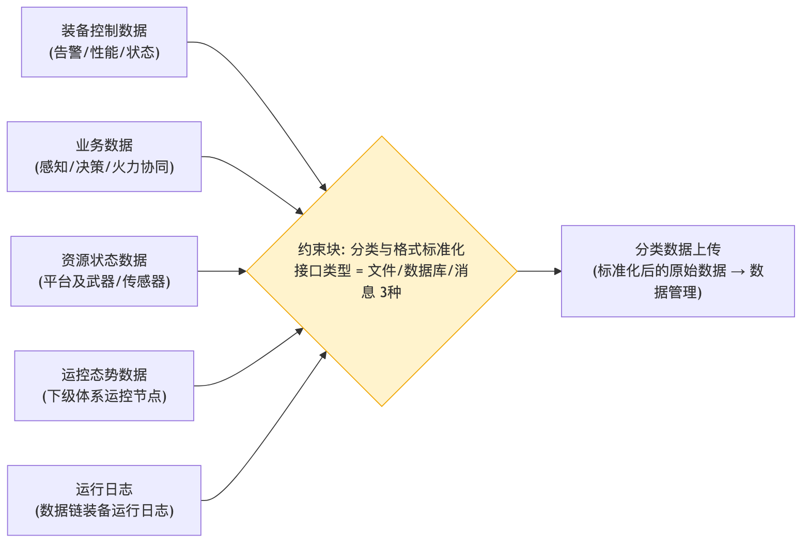

# 数据采集 - 参数图

## 参数图说明

参数图（Parametric Diagram）是 SysML 图，表达**参数之间的约束/计算关系**。

### 本图参数结构

| 类型     | 名称             | 说明                             |
| -------- | ---------------- | -------------------------------- |
| 输入参数 | 装备控制数据     | 告警、性能、状态                 |
| 输入参数 | 业务数据         | 感知/决策/火力协同               |
| 输入参数 | 资源状态数据     | 平台及武器、传感器               |
| 输入参数 | 运控态势数据     | 下级体系运控节点                 |
| 输入参数 | 运行日志         | 数据链装备运行日志               |
| 约束块   | 分类与格式标准化 | 接口类型 = 文件/数据库/消息 3 种 |
| 输出参数 | 分类数据上传     | 标准化后的原始数据 → 数据管理    |

### 约束关系

- 五类原始数据 → 分类与格式标准化（支持文件/数据库/消息 3 种接口）→ 分类数据上传给数据管理。

## 画图素材

- 打开 draw.io 后，看左侧的「Shapes / 图形」面板
- 点击面板底部的「+ More Shapes / 更多图形」
- 在弹窗里勾选 **SysML**（或搜索 Parametric / Constraint），点确定
- 之后左侧就会出现参数图所需的素材：
  - **Constraint Block**（约束块，带等式的圆角矩形）
  - **Value Property**（参数/属性）
  - **Binding Connector**（绑定连接线）
