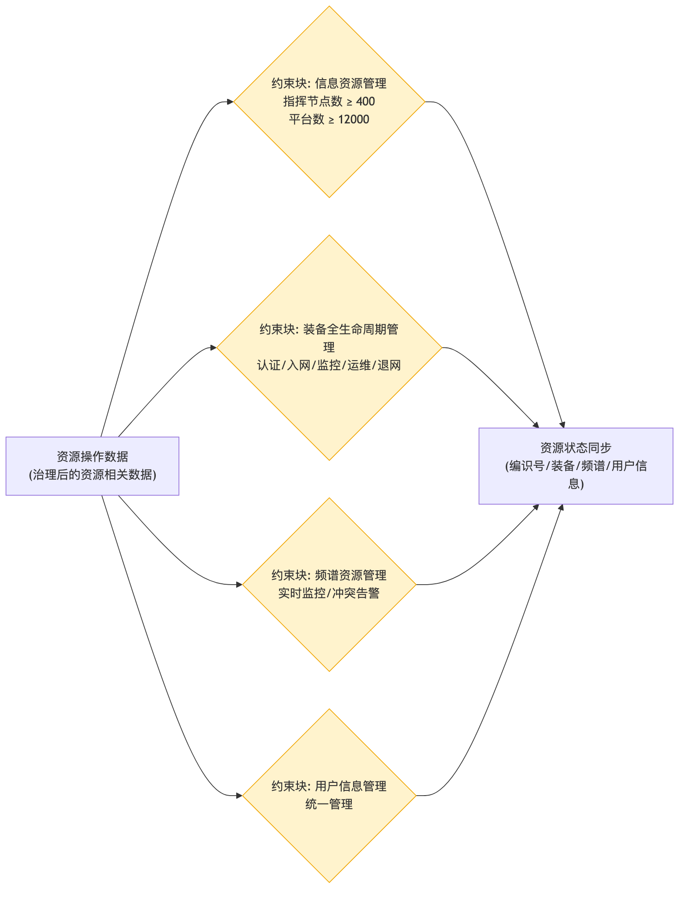

# 资源管理 - 参数图

## 参数图说明

参数图（Parametric Diagram）是 SysML 图，表达**参数之间的约束/计算关系**。

### 本图参数结构

| 类型     | 名称               | 说明                             |
| -------- | ------------------ | -------------------------------- |
| 输入参数 | 资源操作数据       | 治理后的资源相关数据             |
| 约束块   | 信息资源管理       | 指挥节点数 ≥ 400，平台数 ≥ 12000 |
| 约束块   | 装备全生命周期管理 | 认证/入网/监控/运维/退网         |
| 约束块   | 频谱资源管理       | 实时监控、冲突告警               |
| 约束块   | 用户信息管理       | 统一管理                         |
| 输出参数 | 资源状态同步       | 编识号、装备、频谱、用户信息     |

### 约束关系

- 资源操作数据 → 信息资源管理 / 装备全生命周期管理 / 频谱资源管理 / 用户信息管理 → 资源状态同步输出给数据管理。

## 画图素材

- 打开 draw.io 后，看左侧的「Shapes / 图形」面板
- 点击面板底部的「+ More Shapes / 更多图形」
- 在弹窗里勾选 **SysML**（或搜索 Parametric / Constraint），点确定
- 之后左侧就会出现参数图所需的素材：
  - **Constraint Block**（约束块，带等式的圆角矩形）
  - **Value Property**（参数/属性）
  - **Binding Connector**（绑定连接线）
