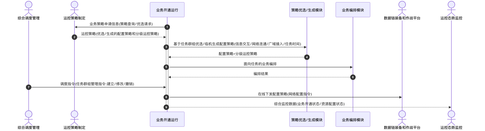

# 业务开通运行 - 顺序图

## 外部交互（表3 业务开通运行外部信息交互关系表）

| 名称             | 信息描述                                               | 交互类型 | 发送方       | 接收方               |
| ---------------- | ------------------------------------------------------ | -------- | ------------ | -------------------- |
| 业务策略申请信息 | 策略查询或优选请求，用以获取任务群组所需的配置策略     | 输出     | 业务开通运行 | 运控策略制定         |
| 运控策略         | 运控策略制定的优选或生成的配置策略和分级运控策略       | 输入     | 运控策略制定 | 业务开通运行         |
| 调度指令         | 综合调度管理下发的任务群组管理指令（建立、修改、撤销） | 输入     | 综合调度管理 | 业务开通运行         |
| 网络配置指令     | 将最终生成的配置策略                                   | 输出     | 业务开通运行 | 数据链装备和作战平台 |
| 综合监控数据     | 业务开通状态、资源配置状态等实时数据                   | 输出     | 业务开通运行 | 运控态势监控         |

## 画图素材

- 打开 draw.io 后，看左侧的「Shapes / 图形」面板
- 点击面板底部的「+ More Shapes / 更多图形」
- 在弹窗里勾选 **UML**（或搜索 Sequence Diagram），点确定
- 之后左侧就会出现顺序图所需的全部素材：
  - **Actor**（参与者/小人）
  - **Lifeline**（生命线）
  - **Activation**（激活条）
  - **Message**（消息）
  - **Combined Fragment**（组合片段：`loop` / `alt` 框）
