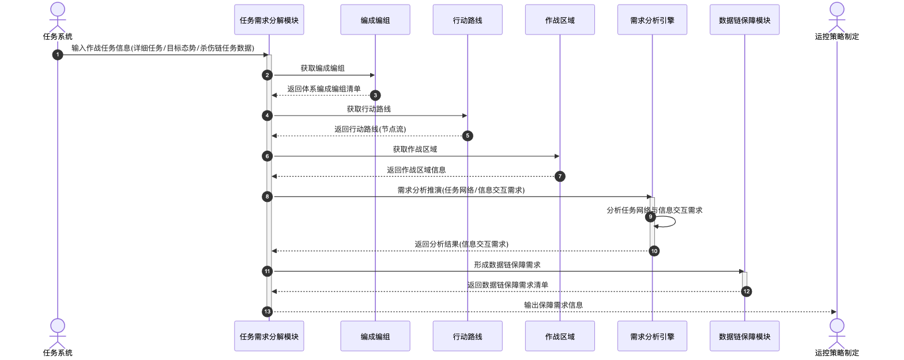

# 任务需求分解 - 顺序图

## 外部交互

| 信息         | 内容                                       | 方向 | 来源/去向                   |
| ------------ | ------------------------------------------ | ---- | --------------------------- |
| 作战任务信息 | 详细作战任务信息、目标态势及杀伤链任务数据 | 输入 | 任务系统 → 任务需求分解     |
| 保障需求信息 | 分析形成的数据链保障需求信息               | 输出 | 任务需求分解 → 运控策略制定 |

## 画图素材

- 打开 draw.io 后，看左侧的「Shapes / 图形」面板
- 点击面板底部的「+ More Shapes / 更多图形」
- 在弹窗里勾选 **UML**（或搜索 Sequence Diagram），点确定
- 之后左侧就会出现顺序图所需的全部素材：
  - **Actor**（参与者/小人）
  - **Lifeline**（生命线）
  - **Activation**（激活条）
  - **Message**（消息）
  - **Combined Fragment**（组合片段：`loop` / `alt` 框）
