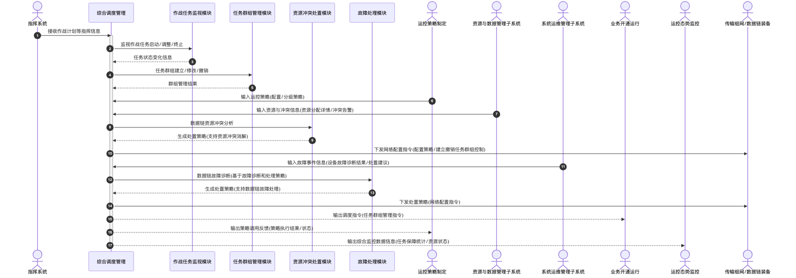

# 综合调度管理 - 顺序图

## 外部交互（表3 综合调度管理外部接口）

| 接口名称         | 功能说明                                                           | 交互类型 | 发送方               | 接收方              |
| ---------------- | ------------------------------------------------------------------ | -------- | -------------------- | ------------------- |
| 运控策略         | 运控策略制定的配置策略、分级运控策略                               | 输入     | 运控策略制定         | 综合调度管理        |
| 资源与冲突信息   | 资源与数据管理子系统的数据链资源分配详情和资源冲突告警信息         | 输入     | 资源与数据管理子系统 | 综合调度管理        |
| 故障事件信息     | 系统运维管理子系统的设备故障诊断结果和处置建议                     | 输入     | 系统运维管理子系统   | 综合调度管理        |
| 调度指令         | 业务开通运行下发的任务群组管理指令（建立、修改、撤销）             | 输出     | 综合调度管理         | 业务开通运行        |
| 策略调用反馈     | 运控策略制定的反馈策略的执行结果或状态                             | 输出     | 综合调度管理         | 运控策略制定        |
| 综合监控数据信息 | 运控态势监控发送的任务保障统计、资源状态等实时数据                 | 输出     | 综合调度管理         | 运控态势监控        |
| 网络配置指令     | 传输组网/数据链装备在线下发的配置策略、建立/撤销任务群组等控制命令 | 输出     | 综合调度管理         | 传输组网/数据链装备 |

## 画图素材

- 打开 draw.io 后，看左侧的「Shapes / 图形」面板
- 点击面板底部的「+ More Shapes / 更多图形」
- 在弹窗里勾选 **UML**（或搜索 Sequence Diagram），点确定
- 之后左侧就会出现顺序图所需的全部素材：
  - **Actor**（参与者/小人）
  - **Lifeline**（生命线）
  - **Activation**（激活条）
  - **Message**（消息）
  - **Combined Fragment**（组合片段：`loop` / `alt` 框）
