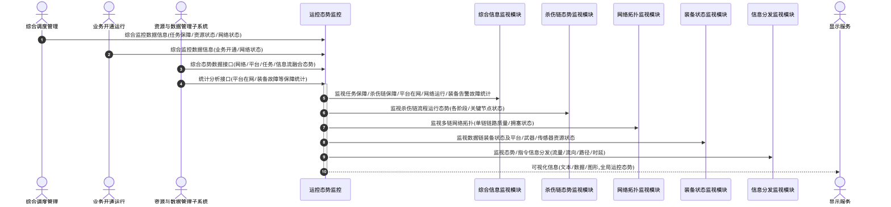

# 运控态势监控 - 顺序图

## 外部交互（表3 运控态势监控外部信息交互关系表）

| 名称             | 信息描述                                                                 | 交互类型 | 发送方                     | 接收方       |
| ---------------- | ------------------------------------------------------------------------ | -------- | -------------------------- | ------------ |
| 综合监控数据信息 | 综合调度管理和业务开通运行的任务保障统计、资源状态、网络状态等实时数据   | 输入     | 综合调度管理、业务开通运行 | 运控态势监控 |
| 综合态势数据接口 | 资源与数据管理子系统的网络、平台、任务及信息流等融合后的综合态势信息     | 输入     | 资源与数据管理子系统       | 运控态势监控 |
| 统计分析接口     | 资源与数据管理子系统的各类保障统计数据（如平台在网统计、装备故障统计等） | 输入     | 资源与数据管理子系统       | 运控态势监控 |
| 可视化信息       | 处理后的全局运控态势（文本、数据、图形），用以通过显示服务进行展示       | 输出     | 运控态势监控               | 显示服务     |

## 画图素材

- 打开 draw.io 后，看左侧的「Shapes / 图形」面板
- 点击面板底部的「+ More Shapes / 更多图形」
- 在弹窗里勾选 **UML**（或搜索 Sequence Diagram），点确定
- 之后左侧就会出现顺序图所需的全部素材：
  - **Actor**（参与者/小人）
  - **Lifeline**（生命线）
  - **Activation**（激活条）
  - **Message**（消息）
  - **Combined Fragment**（组合片段：`loop` / `alt` 框）
