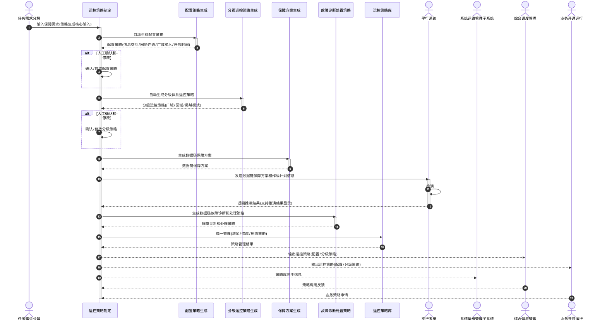

# 运控策略制定 - 顺序图

## 外部交互（表3）

| 名称           | 信息描述                                                   | 交互类型 | 发送方       | 接收方                     |
| -------------- | ---------------------------------------------------------- | -------- | ------------ | -------------------------- |
| 保障需求       | 任务需求分解的数据链保障需求，作为策略生成的核心输入       | 输入     | 任务需求分解 | 运控策略制定               |
| 保障方案       | 数据链保障方案与作战计划，用于推演                         | 输出     | 运控策略制定 | 平行系统                   |
| 推演结果       | 平行系统返回的推演或测试结果                               | 输入     | 平行系统     | 运控策略制定               |
| 策略库同步信息 | 系统运维管理子系统发送生成或修改的数据链故障诊断和处理策略 | 输出     | 运控策略制定 | 系统运维管理子系统         |
| 运控策略       | 生成的配置策略、分级运控策略                               | 输出     | 运控策略制定 | 综合调度管理、业务开通运行 |
| 策略调用反馈   | 综合调度管理反馈的策略执行结果或状态                       | 输入     | 综合调度管理 | 运控策略制定               |
| 业务策略申请   | 业务开通运行发起的策略查询或优选请求                       | 输出     | 业务开通运行 | 运控策略制定               |

> 注：顺序图中箭头按信息流方向绘制；表中「业务策略申请」标注为"输出"，但流向为 业务开通运行 → 运控策略制定。

## 画图素材

- 打开 draw.io 后，看左侧的「Shapes / 图形」面板
- 点击面板底部的「+ More Shapes / 更多图形」
- 在弹窗里勾选 **UML**（或搜索 Sequence Diagram），点确定
- 之后左侧就会出现顺序图所需的全部素材：
  - **Actor**（参与者/小人）
  - **Lifeline**（生命线）
  - **Activation**（激活条）
  - **Message**（消息）
  - **Combined Fragment**（组合片段：`loop` / `alt` 框）
