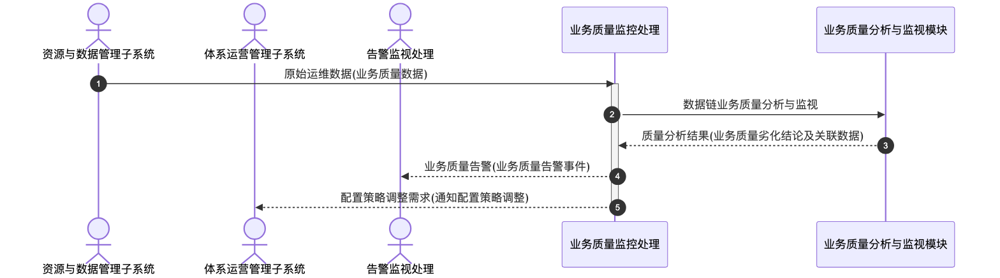

# 业务质量监控处理 - 顺序图

## 外部交互（表3 业务质量监控处理外部接口标识）

| 名称             | 信息描述                                   | 交互类型 | 发送方               | 接收方             |
| ---------------- | ------------------------------------------ | -------- | -------------------- | ------------------ |
| 原始运维数据     | 资源与数据管理子系统的业务质量数据         | 输入     | 资源与数据管理子系统 | 业务质量监控处理   |
| 配置策略调整需求 | 向体系运营管理子系统传送的配置策略调整需求 | 输出     | 业务质量监控处理     | 体系运营管理子系统 |
| 业务质量告警     | 向告警监视处理发送的业务质量告警事件       | 输出     | 业务质量监控处理     | 告警监视处理       |

## 画图素材

- 打开 draw.io 后，看左侧的「Shapes / 图形」面板
- 点击面板底部的「+ More Shapes / 更多图形」
- 在弹窗里勾选 **UML**（或搜索 Sequence Diagram），点确定
- 之后左侧就会出现顺序图所需的全部素材：
  - **Actor**（参与者/小人）
  - **Lifeline**（生命线）
  - **Activation**（激活条）
  - **Message**（消息）
  - **Combined Fragment**（组合片段：`loop` / `alt` 框）
