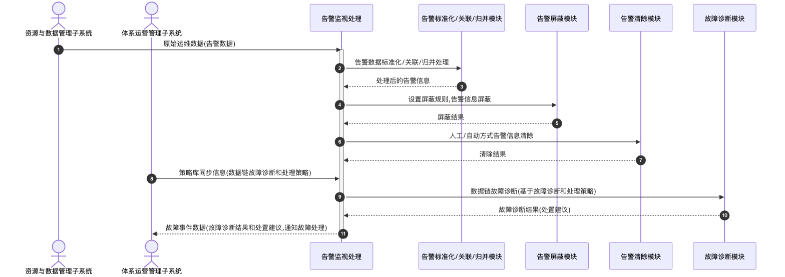

# 告警监视处理 - 顺序图

## 外部交互（表3 告警监视处理外部信息交互关系表）

| 名称           | 信息描述                                                 | 交互类型 | 发送方               | 接收方             |
| -------------- | -------------------------------------------------------- | -------- | -------------------- | ------------------ |
| 原始运维数据   | 资源与数据管理子系统的告警数据                           | 输入     | 资源与数据管理子系统 | 告警监视处理       |
| 故障事件数据   | 体系运营管理子系统的设备故障诊断结果和处置建议           | 输出     | 告警监视处理         | 体系运营管理子系统 |
| 策略库同步信息 | 体系运营管理子系统的生成或修改的数据链故障诊断和处理策略 | 输入     | 体系运营管理子系统   | 告警监视处理       |

## 画图素材

- 打开 draw.io 后，看左侧的「Shapes / 图形」面板
- 点击面板底部的「+ More Shapes / 更多图形」
- 在弹窗里勾选 **UML**（或搜索 Sequence Diagram），点确定
- 之后左侧就会出现顺序图所需的全部素材：
  - **Actor**（参与者/小人）
  - **Lifeline**（生命线）
  - **Activation**（激活条）
  - **Message**（消息）
  - **Combined Fragment**（组合片段：`loop` / `alt` 框）
