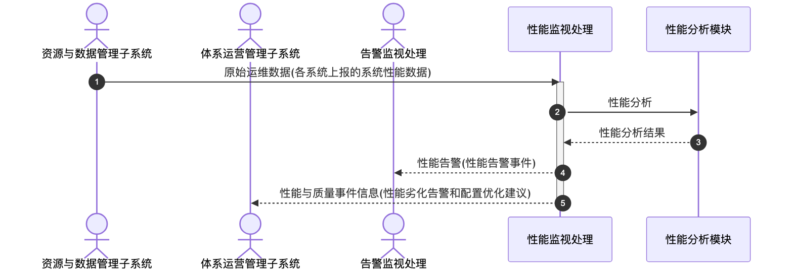

# 性能监视处理 - 顺序图

## 外部交互（表3 性能监视处理外部信息交互关系表）

| 名称               | 信息描述                                       | 交互类型 | 发送方               | 接收方             |
| ------------------ | ---------------------------------------------- | -------- | -------------------- | ------------------ |
| 原始运维数据       | 资源与数据管理子系统的系统性能数据             | 输入     | 资源与数据管理子系统 | 性能监视处理       |
| 性能与质量事件信息 | 体系运营管理子系统的性能劣化告警和配置优化建议 | 输出     | 性能监视处理         | 体系运营管理子系统 |
| 性能告警           | 告警监视处理发送的性能告警事件                 | 输出     | 性能监视处理         | 告警监视处理       |

## 画图素材

- 打开 draw.io 后，看左侧的「Shapes / 图形」面板
- 点击面板底部的「+ More Shapes / 更多图形」
- 在弹窗里勾选 **UML**（或搜索 Sequence Diagram），点确定
- 之后左侧就会出现顺序图所需的全部素材：
  - **Actor**（参与者/小人）
  - **Lifeline**（生命线）
  - **Activation**（激活条）
  - **Message**（消息）
  - **Combined Fragment**（组合片段：`loop` / `alt` 框）
