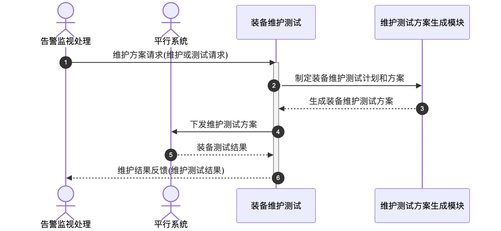

# 装备维护测试 - 顺序图

## 外部交互（表3 装备维护测试软件外部信息交互关系表）

| 接口名称     | 功能说明                     | 交互类型 | 发送方       | 接收方       |
| ------------ | ---------------------------- | -------- | ------------ | ------------ |
| 维护方案请求 | 告警监视处理的维护或测试请求 | 输入     | 告警监视处理 | 装备维护测试 |
| 维护结果反馈 | 告警监视处理反馈维护测试结果 | 输出     | 装备维护测试 | 告警监视处理 |
| 维护测试方案 | 平行系统下发装备维护测试方案 | 输出     | 装备维护测试 | 平行系统     |
| 装备测试结果 | 平行系统接收装备测试结果     | 输入     | 平行系统     | 装备维护测试 |

## 画图素材

- 打开 draw.io 后，看左侧的「Shapes / 图形」面板
- 点击面板底部的「+ More Shapes / 更多图形」
- 在弹窗里勾选 **UML**（或搜索 Sequence Diagram），点确定
- 之后左侧就会出现顺序图所需的全部素材：
  - **Actor**（参与者/小人）
  - **Lifeline**（生命线）
  - **Activation**（激活条）
  - **Message**（消息）
  - **Combined Fragment**（组合片段：`loop` / `alt` 框）
