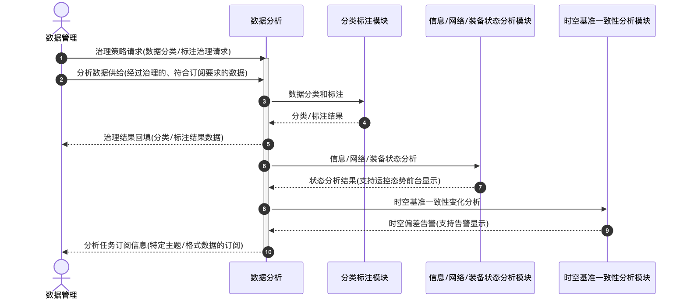

# 数据分析 - 顺序图

## 外部交互（表3 数据分析外部信息交互关系表）

| 名称             | 信息描述                                   | 交互类型 | 发送方   | 接收方   |
| ---------------- | ------------------------------------------ | -------- | -------- | -------- |
| 治理策略请求     | 数据管理的数据分类、标注等治理请求         | 输出     | 数据管理 | 数据分析 |
| 分析数据供给     | 数据管理的、经过治理的、符合订阅要求的数据 | 输出     | 数据管理 | 数据分析 |
| 治理结果回填     | 完成分类、标注等治理操作后的结果数据       | 输出     | 数据分析 | 数据管理 |
| 分析任务订阅信息 | 特定主题、格式的数据的订阅信息             | 输出     | 数据分析 | 数据管理 |

## 画图素材

- 打开 draw.io 后，看左侧的「Shapes / 图形」面板
- 点击面板底部的「+ More Shapes / 更多图形」
- 在弹窗里勾选 **UML**（或搜索 Sequence Diagram），点确定
- 之后左侧就会出现顺序图所需的全部素材：
  - **Actor**（参与者/小人）
  - **Lifeline**（生命线）
  - **Activation**（激活条）
  - **Message**（消息）
  - **Combined Fragment**（组合片段：`loop` / `alt` 框）
