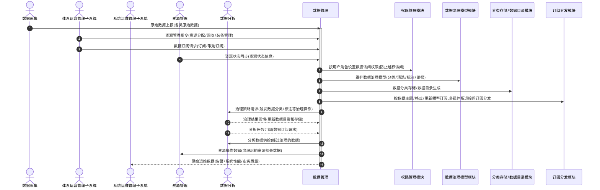

# 数据管理 - 顺序图

## 外部交互（表3 数据管理外部信息交互关系表）

| 名称         | 信息描述                                                             | 交互类型 | 发送方             | 接收方             |
| ------------ | -------------------------------------------------------------------- | -------- | ------------------ | ------------------ |
| 原始数据上报 | 数据采集的各类原始数据                                               | 输入     | 数据采集           | 数据管理           |
| 资源管理指令 | 体系运营管理子系统的资源分配、回收及装备管理等指令                   | 输入     | 体系运营管理子系统 | 数据管理           |
| 数据订阅请求 | 体系运营管理子系统的数据订阅、取消订阅等请求                         | 输入     | 体系运营管理子系统 | 数据管理           |
| 原始运维数据 | 系统运维管理子系统发送告警、系统性能和业务质量数据                   | 输出     | 数据管理           | 系统运维管理子系统 |
| 资源状态同步 | 资源管理的资源状态信息，作为一类重要的状态数据进行统一管理           | 输入     | 资源管理           | 数据管理           |
| 治理策略请求 | 数据分析请求或触发数据分类、标注等治理操作                           | 输出     | 数据管理           | 数据分析           |
| 治理结果回填 | 数据分析完成分类、标注等治理操作后的结果数据，用于更新数据目录和存储 | 输入     | 数据分析           | 数据管理           |
| 分析任务订阅 | 数据分析的数据订阅请求                                               | 输入     | 数据分析           | 数据管理           |
| 分析数据供给 | 数据分析推送或提供其所需的、经过治理的数据                           | 输出     | 数据管理           | 数据分析           |
| 资源操作数据 | 治理后的资源相关数据，支持其进行全生命周期管理、频谱冲突分析等       | 输出     | 数据管理           | 资源管理           |

## 画图素材

- 打开 draw.io 后，看左侧的「Shapes / 图形」面板
- 点击面板底部的「+ More Shapes / 更多图形」
- 在弹窗里勾选 **UML**（或搜索 Sequence Diagram），点确定
- 之后左侧就会出现顺序图所需的全部素材：
  - **Actor**（参与者/小人）
  - **Lifeline**（生命线）
  - **Activation**（激活条）
  - **Message**（消息）
  - **Combined Fragment**（组合片段：`loop` / `alt` 框）
