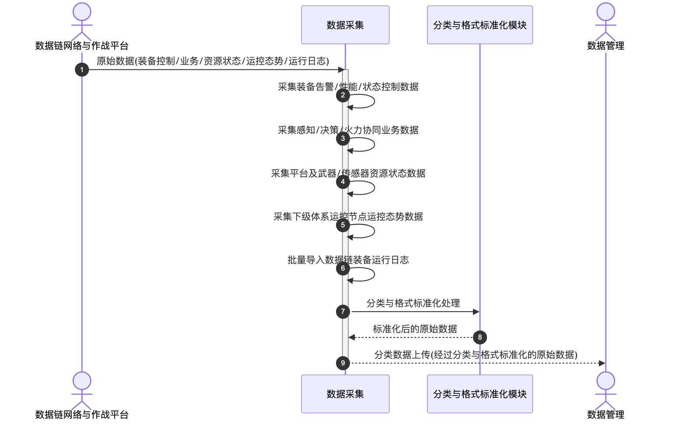

# 数据采集 - 顺序图

## 外部交互（表3 数据采集外部信息交互关系表）

| 名称         | 信息描述                                                                             | 交互类型 | 发送方               | 接收方   |
| ------------ | ------------------------------------------------------------------------------------ | -------- | -------------------- | -------- |
| 原始数据     | 数据链网络与作战平台采集装备控制数据、业务数据、资源状态数据、运控态势数据及运行日志 | 输入     | 数据链网络与作战平台 | 数据采集 |
| 分类数据上传 | 采集到的经过分类与格式标准化后的各类原始数据                                         | 输出     | 数据采集             | 数据管理 |

## 画图素材

- 打开 draw.io 后，看左侧的「Shapes / 图形」面板
- 点击面板底部的「+ More Shapes / 更多图形」
- 在弹窗里勾选 **UML**（或搜索 Sequence Diagram），点确定
- 之后左侧就会出现顺序图所需的全部素材：
  - **Actor**（参与者/小人）
  - **Lifeline**（生命线）
  - **Activation**（激活条）
  - **Message**（消息）
  - **Combined Fragment**（组合片段：`loop` / `alt` 框）
