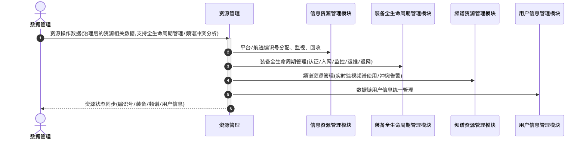

# 资源管理 - 顺序图

## 外部交互（表3 资源管理外部信息交互关系表）

| 名称         | 信息描述                                                               | 交互类型 | 发送方   | 接收方   |
| ------------ | ---------------------------------------------------------------------- | -------- | -------- | -------- |
| 资源状态同步 | 用于同步的管理的资源状态（编识号、装备、频谱、用户信息）               | 输出     | 资源管理 | 数据管理 |
| 资源操作数据 | 数据管理的治理后的资源相关数据，用于支持全生命周期管理、频谱冲突分析等 | 输入     | 数据管理 | 资源管理 |

## 画图素材

- 打开 draw.io 后，看左侧的「Shapes / 图形」面板
- 点击面板底部的「+ More Shapes / 更多图形」
- 在弹窗里勾选 **UML**（或搜索 Sequence Diagram），点确定
- 之后左侧就会出现顺序图所需的全部素材：
  - **Actor**（参与者/小人）
  - **Lifeline**（生命线）
  - **Activation**（激活条）
  - **Message**（消息）
  - **Combined Fragment**（组合片段：`loop` / `alt` 框）
